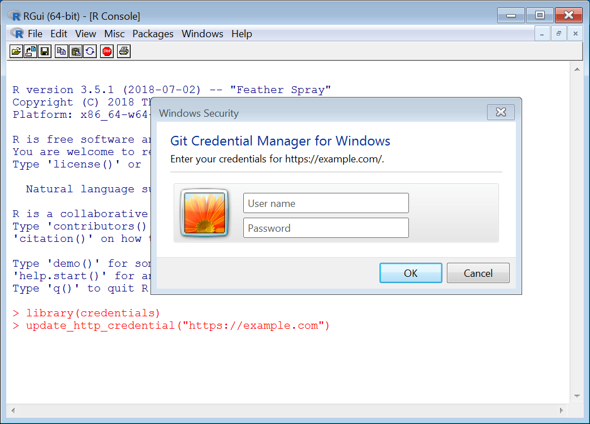
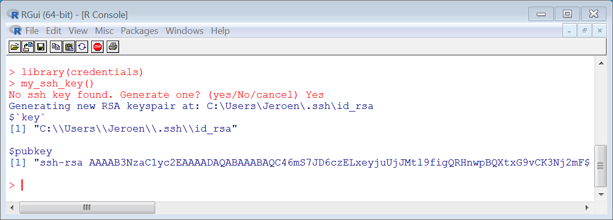

The `credentials` package contains tools for configuring and retrieving SSH and HTTPS credentials for use with `git` or other services. It helps users to setup their git installation, and also provides a back-end for packages to authenticate with existing user credentials.

## Two types of remotes

```{r echo=FALSE}
library <- function(package){
  withCallingHandlers(base::library(credentials), 
                      packageStartupMessage = function(e) {
                        cat(e$message)
                        invokeRestart("muffleMessage")
                      })
}

# If no credential helper has been set, use the 'cache' helper
invisible(tryCatch({
  credentials::credential_helper_get()
}, error = function(...){
  helper <- credentials::credential_helper_list()[1]
  credentials::credential_helper_set(helper, global = TRUE)
}))

# If no key exists, generate one
invisible(tryCatch(credentials::my_ssh_key(), error = function(e){
  credentials::ssh_keygen()
}))
```


```{r}
library(credentials)
```

Git supports two types of remotes: SSH and HTTP. These two use completely distinct authentication systems. 


|         | SSH REMOTES      | HTTPS REMOTES          |
|---------|------------------|------------------------|
| __url__     | `git@server.com` | `https://server.com`   |
| __authentication__    | Personal SSH key          | Password or PAT         |
| __stored in__ | file `id_rsa` or `ssh-agent` | `git credential` store |

For HTTPS remotes, git authenticates with a username + password. Instead of a password you can also use a [Personal Access Token](https://github.com/settings/tokens) (PAT). PATs are preferred because have limited permissions and do not require 2FA.

For SSH remotes, git shells out to `ssh` on your system, and lets `ssh` take care of authentication. This means you have to setup an ssh key (usually `~/.ssh/id_rsa`) which you then [add to your git profile](https://github.com/settings/ssh/new).

### Special note for Windows

Windows does not include a native `git` installation by default. We recommended to use the latest version of [Git for Windows](https://git-scm.com/download/win). This bundle also includes `ssh` and [git credential manager for windows](https://github.com/Microsoft/Git-Credential-Manager-for-Windows) which is all you need.

Important: ssh keys are stored in your home directory for example: `C:\Users\Jeroen\.ssh\id_rsa`, and __not in the Documents folder__ (which is what R treats as the home sometimes). The `ssh_home()` function shows the correct `.ssh` directory on all platforms.

## Part 1: Storing HTTPS credentials

HTTPS remotes do not always require authentication. You can clone from a public repository without providing any credentials. But for pushing, or private repositories, `git` will prompt for a username/password.

```
git clone https://github.com/jeroen/jsonlite
```

To save you from entering your password over and over, git includes a [credential helper](https://git-scm.com/docs/gitcredentials). It has two modes:

 - `cache`: Cache credentials in memory for a short period of time.
 - `store`: Store credentials permanently in your operating system password manager.
 
To see which helper is configured for a given repo, run:

```{r}
credential_helper_get()
```

Most `git` installations default to `store` if supported because it is more convenient and secure. However the look and policy of the git credential store for entering and retrieving passwords can vary by system, because it uses the OS native password manager.

### Acessing the HTTPS Credential Store from R

The `credentials` R package provides a wrapper around the `git credential` command line API for reading and saving credentials. The `git_credential_ask()` function looks up suitable credentials for a given URL from the store. If no credentials are available, it will attempt to prompt the user for credentials and return those instead.

```{r echo=FALSE}
example <- list(protocol = "https", host = "example.com",
  username = "jeroen", password = "supersecret")
credential_approve(example)
```

```{r}
library(credentials)
git_credential_ask('https://example.com')
```

The function `git_credential_update()` looks similar but it behaves slightly different: it first removes existing credentials from the store (if any), then prompt the user for a new username/password, and save these to the store.

```r
# This should always prompt for new credentials
git_credential_update('https://example.com')
```

In a terminal window this will result in an interactive password prompt. In Windows the user might see something like this (depending on the version of Windows and git configutation):



```{r echo=FALSE}
credential_reject(list(protocol = "https", host = "example.com"))
```

### Non-interactive use

Retrieving credentials is by definition interactive, because it the user may be required to enter a password or unlock the system keychain. However, saving or deleting credentials can be sometimes done non-interactively, but this depends on which credential helper is used.

The manual page for `credential_approve` and `credential_reject` has more details about how to call the basic git credential api. 


## Part 2: Managing SSH Keys

For SSH remotes, git does not handle authentication itself. Git simply shells out to `ssh` on your system and uses your standard user ssh configuration. Hence authenticating with SSH git remotes comes down to setting up your ssh keys and copying these to your profile.

The `credentials` package provides a few utility functions to make this easier. The `my_ssh_key()` function calls out to looks up which key that `ssh` uses to connect to a given server. This is usually `~/.ssh/id_rsa` unless you have a fancy custom ssh configuration.

```{r}
str(my_ssh_key())
```

The output shows both the path to your (private) key as well as the ssh pubkey string. The latter is what you have to enter in your [GitHub profile](https://github.com/settings/ssh/new) to associate this key with your user account. You will then be automatically authenticated when using GitHub SSH remotes.

### Generating a key

To use SSH you need a personal key, which is usually stored in `~/.ssh/id_rsa`. If you do not have a key yet, the `my_ssh_key()` function will automatically ask if you want to generate one.



You can also generate a key manually elsewhere using the `ssh_keygen()` function.


